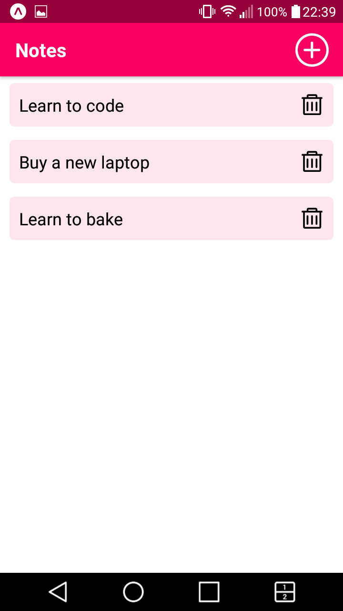
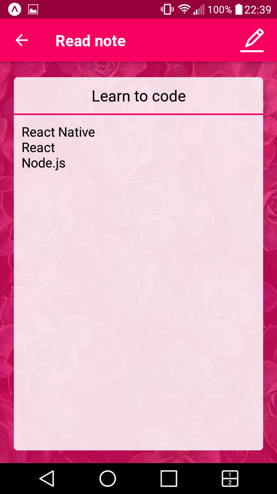
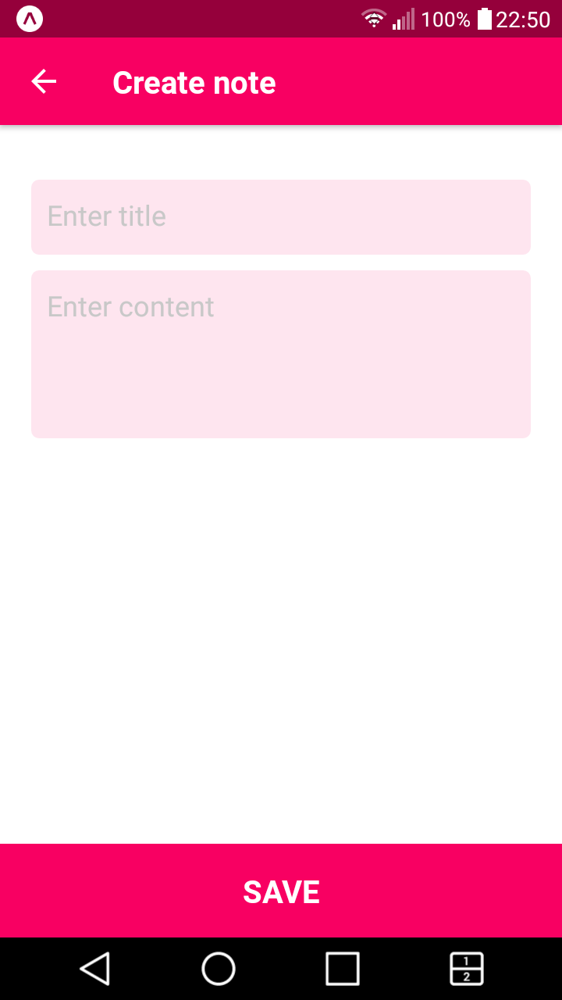
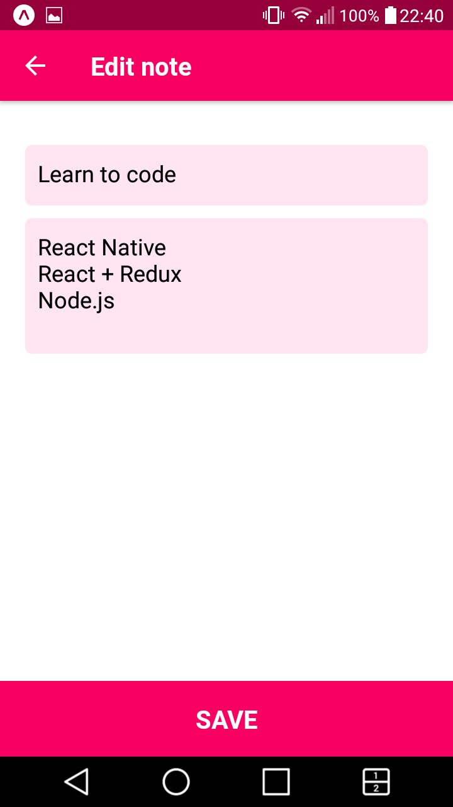

## Notes app

I built this project in order to practice using Context API and React Native.

Using this app user can:
- see a list of notes
- read a note
- add a new note
- update note
- delete note

#### Install & Start

    $ git clone https://github.com/orvalho/notes-app
    $ cd notes-app
    $ npm install
    $ npm start

#### App

#### Stack

-   react
-   expo
-   react-native
-   react-navigation
-   react-navigation-stack
-   @expo/vector-icons